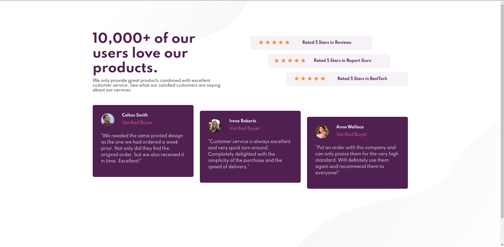

# Frontend Mentor - Social Proof Section

Social proof section design from the website Frontend Mentor.
https://www.frontendmentor.io/challenges/social-proof-section-6e0qTv_bA

Also I used this tool: https://griddy.io/ cause it's my second time to use the grid on CSS.

This is the preview I made:

Live: https://zer0fr0st93.github.io/Social-Proof-Section/
